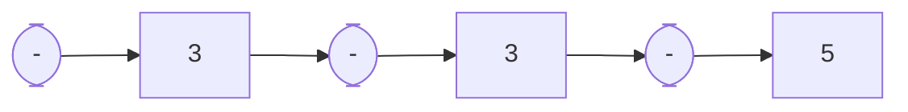

# d7050e_lab2

Lab2 Rust in Rust, parsing to an abstract syntax tree.

## Labs and Learning outcomes

- Regular expressions. In `examples/ex1_regex.rs` you will use the Rust regex crate to parse strings using regular expressions. It also shows the limitations of their usability.

- Simple AST for expressions  `examples/ex2_ast.rs`. You have three small lab assignments here where you manually construct AST expressions, and implement their evaluation.

- Working with `parse` and `TokenStream`, `examples/ex3_token_stream.rs`. Here you extend the parsers to support mul/div and parenthesis.

- In `examples/ex3_token_stream.rs` you add support for Boolean operators and look further into how the parsers work. You document your Expr syntax as an EBNF specification in `examples/ex4.md`. Look below for formatting tips using inline latex in Gitlab markdown.

## Parsing theory

When implementing a recursive decent parser you may run into infinite recursion if not careful. In this lab we work with a LR1, left-right parser by hand, with 1 token lookahead (for cases where we need to check for different patterns). Infinite recursion is avoided by assuming a "terminal" at leftmost position of the expression.

Without modifications, this will render an AST that represent an expression without precedence (priority) between operators, e.g. `2 * 3 + 4`, will be parsed into a tree, `2 * (3 + 4)`. Regarding associativity it will parse `2 - 3 - 4 - 5` into `2 - (3 - (4 - 5))`, which does not adhere to the mathematical intuition of expressions.

We can solve this problem in many way, e.g., directly in the parser or as a post processing step (rewriting the AST).

### syn parsing

In this lab we use the Rust `proc_macro2` crate together with the `syn` crate for generating a token stream and parse the stream into our own AST. `syn` comes with parsers for the complete Rust language, but in this exercise we will instead define our own parsers. You do that by implementing the `Parse` trait (the `parse` function) for your AST types. Taking a functional approach the `parse` function is stateless, hence it is cumbersome (or even impossible) to maintain necessary state information to take precedence associativity into account during the parsing. Instead we post process the right associative representation into a new AST (taking precedence and associativity into account).

We adopt the precedence climbing approach (adopted by e.g., gcc and other realistic compilers).

```raw
parse_expression_1(lhs, min_precedence)
    lookahead := peek next token
    while lookahead is a binary operator whose precedence is >= min_precedence
        op := lookahead
        advance to next token
        rhs := parse_primary ()
        lookahead := peek next token
        while lookahead is a binary operator whose precedence is greater
                 than op's, or a right-associative operator
                 whose precedence is equal to op's
            rhs := parse_expression_1 (rhs, min_precedence + 1)
            lookahead := peek next token
        lhs := the result of applying op with operands lhs and rhs
    return lhs
```

Example 1)
Assume the expression `2 - 3 - 4 - 5`, this will after parsing have the below AST representation. Evaluating this will render the result `2 - (3 - (4 - 5))`.


In order to apply this algorithm, we first turn the AST `Expr` into a scanner (an iterator providing, peek and next on a sequence), see `src/parse.rs` `to_vec`.


The algorithm is started of by picking the first literal as the `lhs` and then calling the recursive `climb_rec(lhs, 0, scanner)`.

```rust
// A trampoline to start of the precedence climbing
pub fn climb(e: Expr) -> Expr {
    // flatten the Expr into a vector
    let v: Vec<ExprItems> = to_vec(e);
    // turn the vector into a Scanner
    let mut scanner = v.iter().rev().peekable();
    // take the first literal
    let lhs: Expr = scanner.next().unwrap().get_lit().into();
    // now call the climber
    climb_rec(lhs, 0, &mut scanner)
}
```

When first entering the `climb_rec` the scanner holds the first operator.



The `climb_rec` will iterate over each operator in the outer while loop, and reconstruct a left associate AST representation ((2 - 3) -4) -5. The inner while condition `o.priority() > op.priority()`, will obviously not be met as our expression only has `-' operators. 


Example 2)
Now let's have a look at a more interesting example, parsing 2 - 3 * 4 - 5


In this case we will enter the inner while loop when peeking the "*" operator, this will cause a recursive call `climb_rec(lhs = "1", min_precedence = 1, scanner = "3 * 4 - 5")`. In the recursive call we build one node (`3 * 4` as the `rhs`) and return (as the peeked operator is now `-` with a lower priority than then current `min_precedence = 1`). On return of the recursive call `lhs = "1"`, op = `-`, and `rhs = "2 * 3"`, from which we build `lhs = "2 - 3 * 4"`. The scanner is now "- 5", the peek "-" precedence condition holds in the outer while, but the inner not, thus we bind to the left, `lhs = "(2 - 3 * 4) - 5"`. The outer peek condition now fails, and we finally return the below AST.


### Implementation 

The Rust implementation is straightforward. The only major difference to the pseudo-code reference algorithm is the addition of `scanner: &mut Scanner` as an argument. The pseudo-code assumes there will be a global peekable resource (which might be memory unsafe). In our implementation, the scanner resource is safely passed around (this is checked at compile time.)

Worth to mention is the helper function `peek_precedence`. Besides the `scanner` argument, it takes a closure `f: Fn(u8) -> bool`, which will be invoked with the priority of the peeked operator `f(op.priority())`. In the `climb_rec` code its being used in the outer while with the condition `|op_precedence| op_precedence >= min_precedence`, and similarly in the inner while, with the condition `|op_precedence| op_precedence > op.priority`.

```rust
fn peek_precedence<F>(scanner: &mut Scanner, f: F) -> bool
where
    F: Fn(u8) -> bool,
{
    if let Some(ExprItems::Op(op)) = scanner.peek().clone() {
        f(op.priority())
    } else {
        false
    }
}
```

Complete Rust implementation:

```rust
// A one-to-one implementation of the "wikipedia" algorithm.
fn climb_rec(mut lhs: Expr, min_precedence: u8, scanner: &mut Scanner) -> Expr {
    while peek_precedence(scanner, |op_precedence| op_precedence >= min_precedence) {
        // op := lookahead
        let op: Op = scanner.next().unwrap().get_op();
        // advance to next token
        // rhs := parse_primary ()
        let mut rhs: Expr = scanner.next().unwrap().get_lit().into();
        // while lookahead is a binary operator whose precedence is greater
        //                  than op's, or a right-associative operator
        //                  whose precedence is equal to op's
        while peek_precedence(scanner, |op_precedence| op_precedence > op.priority()) {
            // rhs := parse_expression_1 (rhs, min_precedence + 1)
            rhs = climb_rec(rhs, min_precedence + 1, scanner);
            // lookahead := peek next token
            // scanner will be updated since we passed it recursively
        }
        // lhs := the result of applying op with operands lhs and rhs
        lhs = BinOp(op, Box::new(lhs), Box::new(rhs));
    }
    lhs
}
```

Notice, this is a direct translation of the original algorithm. The `min_precedence + 1` seems incorrect, instead you should likely add the difference in between current precedence and the new precedence, but in case you have only two precedence levels it will work as of now.

## Gitlab and Markdown

When working on the `ex4.md` and later the SOS and Type checking formalizations, proper type setting makes things easier to read. Gitlab supports rendering of inlined latex.

## Example of latex type setting for gitlab

For larger blocks:

```math
\frac{<e_1,σ> → <n_1, σ'> <e_2, σ'> → <n_2, σ''>}{<e_1 - e2, σ> → <n_1 \text{ sub } n_2, σ''>}
```

If you want to inline math in your text, use $`math\frac{1}{2}`$. You may also use unicode characters like σ for your notation.

## Vscode extensions

Vscode has excellent preview support of Markdown. I use:

- `Markdown+Math`. (LaTex support) Setting the `"mdmath.delimeters": "gitlab"` makes the preview adhere to gitlab. To make it work I had to disable the built in math rendering, `"markdown.math.enabled": false`.

- `Markdown Preview Mermaid`. (Mermaid graphs and charts).

- `markdownlint`. (Checks that you follow the Markdown standard).

- `Markdown All in One`. (More nifty markdown support).

- `Code Spell Checker`. (Spell checking of your documents). The plugin is somewhat code aware an less picky, you can choose to add words to ignore and have them stored per project in the `.vscode` catalogue.)
  
These are some of the plugins that I typically use and can recommend. If you have tips on others, make an issue on this repo (or even a pull/merge request).
